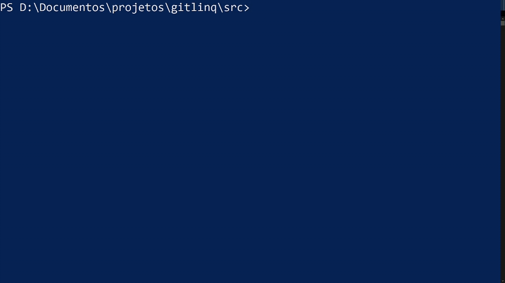

# GitLinq

[](https://dotnet.microsoft.com/)
[](https://www.nuget.org/packages/GitLinq)
[](LICENSE)

Query your Git commit history using LINQ-like syntax directly from the command line.

<p align="center">
  
</p>

## Features

- 🔍 **LINQ-like Query Syntax** - Use familiar C# LINQ methods to query commits
- 🎯 **Interactive Mode** - REPL with autocomplete and command history
- ⚡ **CLI Mode** - Execute single queries for scripting and automation
- 📊 **Rich Output** - Beautiful tables powered by Spectre.Console
- 🔧 **Extensible Commands** - Built-in help, examples, and history commands

## Installation

### Prerequisites

- [.NET 8.0 SDK](https://dotnet.microsoft.com/download/dotnet/8.0) or later

### Install from NuGet (Recommended)

```bash
dotnet tool install --global GitLinq
```

### Build from Source

```bash
git clone https://github.com/williamguilhermesouza/gitlinq.git
cd gitlinq/src
dotnet build
dotnet run
```

### Install from Source as Global Tool

```bash
cd src
dotnet pack -c Release
dotnet tool install --global --add-source ./bin/Release GitLinq
```

## Usage

### Interactive Mode

Simply run `gitlinq` inside any Git repository:

```bash
gitlinq
```

You'll enter an interactive REPL where you can type queries:

```
GitLinq - Query git commits using LINQ-like syntax
Type 'help' for available commands or enter a query.

gitlinq> Commits.Take(5)
```

### Command Line Mode

Execute a single query and exit:

```bash
gitlinq -q "Commits.Take(10)"
gitlinq --query "Commits.Where(c => c.Message.Contains(\"fix\"))"
```

### Command Line Options

| Option | Description |
|--------|-------------|
| `-q, --query <query>` | Execute a single query and exit |
| `-h, --help` | Show help message |

### Environment Variables

| Variable | Description |
|----------|-------------|
| `GITLINQ_DEBUG=1` | Enable debug mode for troubleshooting terminal/encoding issues |

## Query Syntax

GitLinq supports a LINQ-like query syntax to filter, transform, and aggregate commits.

### Data Sources

GitLinq provides two data sources for querying:

| Source | Description |
|--------|-------------|
| `Commits` | Basic commit information (fast) |
| `Diffs` | Commits with file change statistics (includes added/deleted lines per file) |

### Commits Properties

| Property | Type | Description |
|----------|------|-------------|
| `Sha` | string | Full commit SHA hash |
| `Message` | string | Full commit message |
| `MessageShort` | string | First line of commit message |
| `AuthorName` | string | Author's name |
| `AuthorEmail` | string | Author's email |
| `AuthorWhen` | DateTimeOffset | Author timestamp |

### Diffs Properties (CommitDiff)

| Property | Type | Description |
|----------|------|-------------|
| `Sha` | string | Full commit SHA hash |
| `ShortSha` | string | 7-character SHA |
| `Message` | string | Full commit message |
| `MessageShort` | string | First line of commit message |
| `AuthorName` | string | Author's name |
| `AuthorEmail` | string | Author's email |
| `AuthorWhen` | DateTimeOffset | Author timestamp |
| `Files` | List&lt;FileChange&gt; | List of changed files |
| `TotalLinesAdded` | int | Sum of lines added across all files |
| `TotalLinesDeleted` | int | Sum of lines deleted across all files |
| `FilesChanged` | int | Number of files changed |

### FileChange Properties

| Property | Type | Description |
|----------|------|-------------|
| `Path` | string | File path |
| `OldPath` | string? | Previous path (for renamed files) |
| `Status` | string | Change type: Added, Deleted, Modified, Renamed |
| `LinesAdded` | int | Lines added in this file |
| `LinesDeleted` | int | Lines deleted in this file |
| `IsBinary` | bool | Whether file is binary |

### Supported Methods

| Method | Description | Example |
|--------|-------------|---------|
| `Take(n)` | Get first n commits | `Commits.Take(10)` |
| `Skip(n)` | Skip first n commits | `Commits.Skip(5)` |
| `First()` | Get first commit | `Commits.First()` |
| `First(predicate)` | Get first matching commit | `Commits.First(c => c.Message.Contains("fix"))` |
| `FirstOrDefault()` | Get first commit or null | `Commits.FirstOrDefault()` |
| `FirstOrDefault(predicate)` | Get first matching or null | `Commits.FirstOrDefault(c => c.AuthorName.Contains("Alice"))` |
| `Where(predicate)` | Filter commits | `Commits.Where(c => c.Message.Contains("feat"))` |
| `Select(selector)` | Project commits | `Commits.Select(c => c.Message)` |
| `OrderBy(selector)` | Sort ascending | `Commits.OrderBy(c => c.AuthorName)` |
| `OrderByDescending(selector)` | Sort descending | `Commits.OrderByDescending(c => c.AuthorWhen)` |
| `Count()` | Count all commits | `Commits.Count()` |
| `Count(predicate)` | Count matching commits | `Commits.Count(c => c.AuthorName.Contains("Bob"))` |
| `Any()` | Check if commits exist | `Commits.Any()` |
| `Any(predicate)` | Check if any match | `Commits.Any(c => c.Message.Contains("hotfix"))` |

### String Methods in Predicates

| Method | Example |
|--------|---------|
| `Contains(text)` | `c.Message.Contains("fix")` |
| `StartsWith(text)` | `c.Message.StartsWith("feat")` |
| `EndsWith(text)` | `c.Message.EndsWith("!")` |

### Comparison Operators in Predicates

| Operator | Example |
|----------|---------|
| `>` | `d.FilesChanged > 5` |
| `<` | `d.TotalLinesAdded < 100` |
| `>=` | `d.FilesChanged >= 3` |
| `<=` | `d.TotalLinesDeleted <= 10` |
| `==` | `d.FilesChanged == 1` |
| `!=` | `d.FilesChanged != 0` |

## Example Queries

### Basic Commit Queries

```bash
# Get all commits
Commits

# Get the first 10 commits
Commits.Take(10)

# Pagination: skip 5, take 10
Commits.Skip(5).Take(10)

# Get the most recent commit
Commits.First()

# Count total commits
Commits.Count()

# Find commits with 'fix' in message
Commits.Where(c => c.Message.Contains("fix"))

# Find commits by author
Commits.Where(c => c.AuthorName.Contains("Alice"))

# Find commits starting with 'feat' (conventional commits)
Commits.Where(c => c.Message.StartsWith("feat"))

# Find first commit mentioning 'bug'
Commits.First(c => c.Message.Contains("bug"))

# Check if any hotfix commits exist
Commits.Any(c => c.Message.Contains("hotfix"))

# Count commits by a specific author
Commits.Count(c => c.AuthorName.Contains("Bob"))

# Chain multiple operations
Commits.Where(c => c.AuthorName.Contains("Alice")).Take(5)
```

### Diff Queries (with file change statistics)

```bash
# Get all commits with diff stats
Diffs.Take(10)

# Find commits that changed more than 5 files
Diffs.Where(d => d.FilesChanged > 5)

# Find commits with more than 100 lines added
Diffs.Where(d => d.TotalLinesAdded > 100).Take(10)

# Find commits with significant deletions
Diffs.Where(d => d.TotalLinesDeleted >= 50)

# Get files changed in the most recent commit
Diffs.First().Files

# Find single-file commits
Diffs.Where(d => d.FilesChanged == 1).Take(10)

# Find large refactoring commits (many files, many changes)
Diffs.Where(d => d.FilesChanged >= 10).Take(5)
```

## Interactive Commands

| Command | Aliases | Description |
|---------|---------|-------------|
| `help` | `h`, `?` | Show available commands |
| `examples` | `ex`, `samples` | Show example queries |
| `history` | `hist` | Show command history |
| `clear` | `cls` | Clear the screen |
| `exit` | `quit`, `q` | Exit GitLinq |

## Architecture

```
src/
├── Program.cs              # Entry point, CLI handling
├── QueryParser.cs          # Sprache-based LINQ parser
├── LinqExpressionBuilder.cs # AST to LINQ Expression converter
├── AutoCompletionHandler.cs # Tab completion for REPL
├── AST/                    # Abstract Syntax Tree nodes
│   ├── BaseNode.cs
│   ├── IdentifierNode.cs
│   ├── StringLiteralNode.cs
│   ├── NumberLiteralNode.cs
│   ├── MemberAccessNode.cs
│   ├── MethodCallNode.cs
│   ├── LambdaNode.cs
│   └── BinaryNode.cs
├── Commands/               # Interactive command system
│   ├── ICommand.cs
│   ├── CommandRegistry.cs
│   ├── CommandContext.cs
│   └── ...
└── Services/
    └── GitService.cs       # Git repository operations
```

## Dependencies

- [LibGit2Sharp](https://github.com/libgit2/libgit2sharp) - Git repository access
- [Sprache](https://github.com/sprache/Sprache) - Parser combinator library
- [Spectre.Console](https://github.com/spectreconsole/spectre.console) - Beautiful console output
- [ReadLine](https://github.com/tonerdo/readline) - GNU Readline-like input with history

## Development

### Running Tests

```bash
dotnet test
```

### Project Structure

- `src/` - Main application source code
- `tests/` - Unit tests for parser and expression builder

## Troubleshooting

If you encounter issues (especially on Windows PowerShell or CMD), enable debug mode:

```bash
# Windows PowerShell
$env:GITLINQ_DEBUG="1"
gitlinq

# Windows CMD
set GITLINQ_DEBUG=1
gitlinq

# Linux/macOS
GITLINQ_DEBUG=1 gitlinq
```

Debug mode displays:
- OS and .NET runtime information
- Console encoding settings (important for quote handling)
- Terminal type detection
- Input byte analysis (helps identify encoding issues)

**Common Issues:**
- **"No commits found" when using Contains()**: This was caused by null bytes being inserted by the ReadLine library on some Windows terminals. Fixed in v0.0.2+.
- **Garbled output**: Ensure your terminal supports UTF-8. The tool sets UTF-8 encoding automatically.

## Contributing

Contributions are welcome! Please feel free to submit a Pull Request.

1. Fork the repository
2. Create your feature branch (`git checkout -b feature/amazing-feature`)
3. Commit your changes (`git commit -m 'Add some amazing feature'`)
4. Push to the branch (`git push origin feature/amazing-feature`)
5. Open a Pull Request

## License

This project is licensed under the MIT License - see the [LICENSE](LICENSE) file for details.

## Roadmap

- [ ] Support for branches and tags queries
- [ ] Date range filtering (`c.AuthorWhen > "2024-01-01"`)
- [ ] File change statistics per commit
- [ ] Export results to JSON/CSV
- [ ] Configuration file support
- [ ] More LINQ methods (`Last`, `Single`, `Distinct`, `GroupBy`)

---

Made with ❤️ by [William Guilherme](https://github.com/williamguilhermesouza) using .NET 8.0
